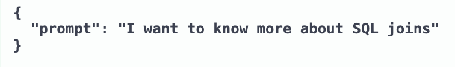
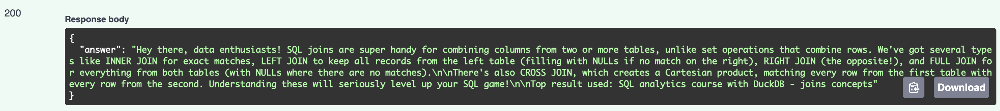

# RAG-youtuber-lab

This project is a Fullstack Retrieval-Augmented Generation (RAG) with PydanticAI, LanceDB, FastAPI and Streamlit.

The project allows you to:

Ingest data from youtube content transcriptions into a local vector database (**knowledge_base**)

Query the **knowledge_base** through a FastAPI backend

Interactively chat with an Agent based on the knowledge base through a Streamlit frontend

*For personal experimentation:*
Make changes to the Agent with a different system prompt and/or test different questions.

## Setup

### Initialize project

    - uv init

    - uv add "package name"
        example: uv add fastapi
        
    - alternatively sync with this project using
        uv sync

### .env with API key to Gemini

[API-key](https://aistudio.google.com/app/api-keys)

    - Login with google account and create a new API key

    Then create a .env file in root of your project.
    Write this in the file:

    - GOOGLE_API_KEY=<your generated/created API-key>

    IMPORTANT!
    .env should be .gitignored but double check it so you don't accidentally leak any credentials

### Ingestion to db (knowledge base)

From root folder in project:

    uv run ingestion.py

### Test API with FastAPI

From root folder in project:

    - uv run uvicorn api:app --reload

    Open up:

    - http://127.0.0.1:8000/docs

Try it out with a question:

### Run in Streamlit frontend

From root folder in project:

    - uv run streamlit run frontend/app.py